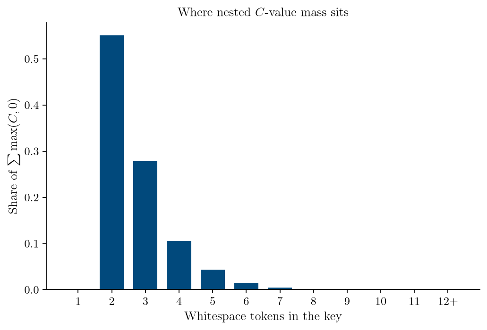
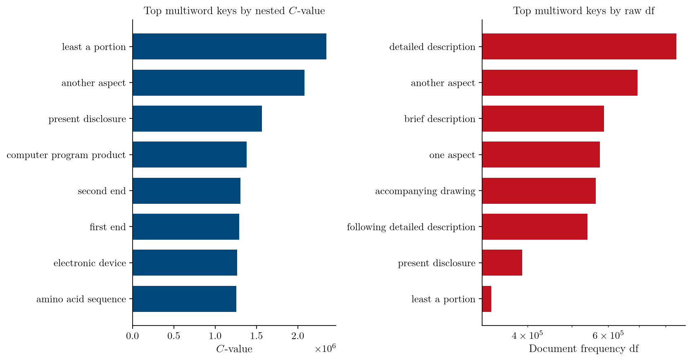
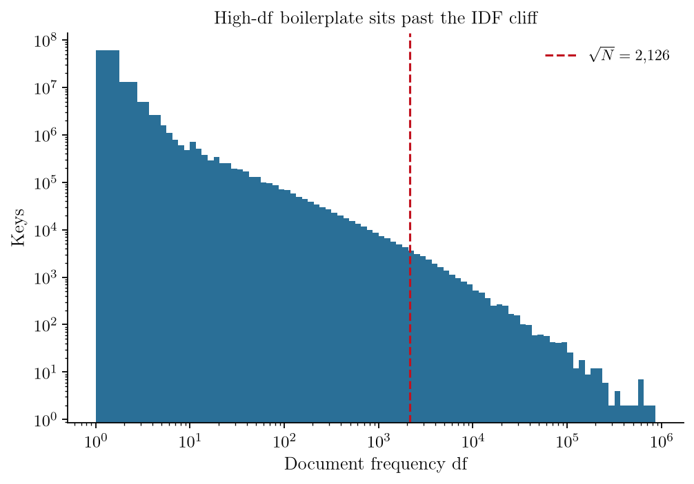
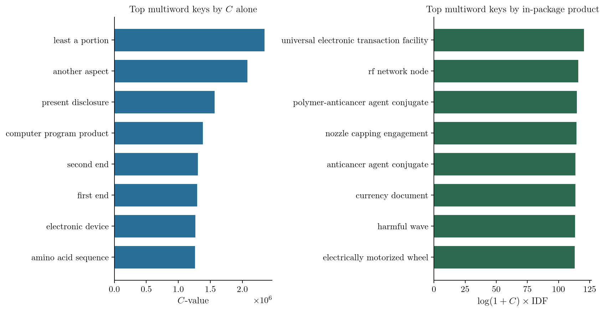

# patent-ate

[](https://github.com/Qubut/patent-ate/actions/workflows/ci.yml)
[](https://www.python.org/downloads/)
[](LICENSE)
[](https://huggingface.co/datasets/Qubut/patent-ate-hupd)

patent-ate finds the technical phrases that actually appear in patent text
and scores each one by how much it behaves like a real term, not a generic
word.

Patents repeat short generic words such as "panel" and "method" inside
longer phrases. "Vehicle interior panel" contains "interior panel" and
"panel", so counting mentions ranks boilerplate highest. A lawyer or
engineer looking for the invention then sees "panel" at the top of the list.

C-value is a published score that down-weights those fragments by rewarding
longer phrases and subtracting the times a short string showed up only
inside a longer one (Frantzi, Ananiadou, and Mima, [*Automatic recognition
of multi-word terms: the C-value/NC-value method*](https://link.springer.com/article/10.1007/s007999900023),
2000). This tool computes that score on a collection of patents, following
the formula in [JATE](https://github.com/ziqizhang/jate) 3.3, an open-source
toolkit for ranking phrases, and writes a table of each phrase, its
C-value, and how many documents contain it.

C-value still keeps headings that stand on their own in many patents, such
as "another aspect". The table therefore also stores document frequency:
the number of patents that contain the phrase.

## Install and run

```text
uv add patent-ate
```

Until the first PyPI release, depend on the git repository:

```text
uv add 'patent-ate @ git+https://github.com/Qubut/patent-ate'
```

patent-ate reads a directory of JSON files, one patent object per file,
and looks for text in the `claims`, `abstract`, and `summary` fields.
Missing fields are skipped. Multi-record Hugging Face files (JSONL or
Parquet) are not read directly; write one JSON object per file first.

Sample the directory, extract phrases, score them, and write the table in
one job:

```text
patent-ate corpus \
  --output ./termhood \
  --input-dir ./patents \
  --limit 1000 \
  --extract-workers 0 \
  --extract-block-rows 256
```

`--extract-workers 0` leaves one CPU free for Ray, the library that
schedules the extraction workers. Pass a positive count to run more
workers. `--config` is optional YAML for the spaCy English model (the
parser that finds noun phrases), DuckDB memory, and phrase matching;
package defaults apply when it is omitted.

Extract phrases first, then score without re-parsing the JSON:

```text
patent-ate extract --output ./termhood --input-dir ./patents --limit 1000
patent-ate score --extract ./termhood/extract --output ./termhood
```

`inspect` prints how many phrases a saved table contains. The output
directory can keep more than one scored table from later runs;
`list-generations` prints those files. The Python package runs the same
steps: extract a collection, score Parquet files, and open the table the
output directory currently selects.

## Evidence from the Harvard USPTO Patent Dataset

Suzgun, Melas-Kyriazi, Sarkar, Kominers, and Shieber (2022) released the
**Harvard USPTO Patent Dataset (HUPD)**: English-language US utility
applications whose JSON objects already carry `claims`, `abstract`, and
`summary`
([dataset](https://huggingface.co/datasets/HUPD/hupd),
[paper](https://arxiv.org/abs/2207.04043),
[site](https://patentdataset.org)). Scoring that collection with this
package produced 88,607,764 phrases across 4,518,254 applications. The
saved columns are the phrase (`key`), C-value (`c_value`), and document
frequency (`df`).

Most of that C-value sits in short strings. Two-word keys hold about half
of the positive mass, three-word keys most of the rest; unigrams barely
register and phrases of six words or more are a thin tail. Nested scoring
matters because the fragments that inflate a raw count are exactly those
two- and three-word shells.



Hyphenation and plural endings stay as written. The table also stores a
lowercase lookup spelling so either form can be found, which is why
"lithium ion battery" and "lithium-ion battery" are separate rows.

On that table, C-value and raw document frequency still agree on legal
headings. "Least a portion" leads C-value as a high-frequency claim
fragment that also stands alone; "detailed description" leads `df` as a
section title. The last column below is a combined rank: a high number is
a rare technical phrase; zero means the phrase is too common to keep as a
single rank.

| Phrase | C-value | Documents (`df`) | Combined rank |
| --- | ---: | ---: | ---: |
| `least a portion` | 2,345,468 | 333,608 | 0 |
| `another aspect` | 2,080,434 | 694,564 | 0 |
| `present disclosure` | 1,568,066 | 390,064 | 0 |
| `computer program product` | 1,381,133 | 154,388 | 0 |
| `detailed description` | 1,061,982 | 843,582 | 0 |
| `lithium ion battery` | 22,744 | 3,018 | 0 |
| `lithium-ion battery` | 9,028 | 1,756 | 71.5 |
| `sina molecule` | 86,557 | 317 | 108.7 |

Side by side, the two rankings share those headings: the left list still
opens with claim fragments such as "least a portion", and the right list
is section titles such as "detailed description".



To down-weight phrases that appear in most of the collection, the library
can multiply log(1 + C-value) by inverse document frequency, a weight that
shrinks as a phrase appears in more documents (Sparck Jones, 1972; Lucene
BM25-style). The product is zero when `df * df` exceeds the document count,
so a phrase that appears in more than about √N documents drops out of a
single ranked list. Almost every key in the histogram sits at small `df`;
the long tail past √N ≈ 2,126 is where those headings live, and about
8.65 million phrases (9.8%) hit the cutoff.



`lithium ion battery` (df 3,018) sits past that line and scores zero;
the hyphenated sibling `lithium-ion battery` (df 1,756) keeps a combined
rank of 71.5. The published parquet stores phrase, C-value, and document
frequency; multiply them in this library when you need one rank.

That product is what ranks rare technical compounds instead of those
headings: the left ranking still lists "least a portion", while the right
ranking lists phrases such as "rf network node" and
"polymer-anticancer agent conjugate".



## Get the published table

A 3,393-row preview on
[Qubut/patent-ate-hupd](https://huggingface.co/datasets/Qubut/patent-ate-hupd)
mixes C-value leaders, high-`df` headings, combined-rank leaders, phrases
of different lengths, and a random draw. Load that slice before fetching
the full parquet.

```python
from datasets import load_dataset

preview = load_dataset('Qubut/patent-ate-hupd', 'slice', split='preview')
```

```python
import polars as pl

pl.scan_parquet(
    'hf://datasets/Qubut/patent-ate-hupd/slice/preview.parquet'
).head(20).collect()
```

```python
import duckdb

con = duckdb.connect('preview.duckdb')  # download slice/preview.duckdb
con.sql("SELECT * FROM termhood_slice WHERE stratum = 'top_score' LIMIT 10")
```

`load_dataset('Qubut/patent-ate-hupd', split='termhood')` opens the full
table. The derived phrase table follows HUPD's license (CC BY-NC-SA 4.0);
this software is MIT.

## Development

In a local clone, Python 3.12 tools come from devenv:

```text
devenv shell -- uv sync --group dev --group test
devenv shell -- ruff check src tests
devenv shell -- ruff format --check src tests
devenv shell -- mypy src
devenv shell -- pytest
```

The CPU image `ghcr.io/qubut/patent-ate` has entrypoint `patent-ate`. Tags
and conventional-commit changelogs follow `v*` releases.

## License

[MIT](./LICENSE)
